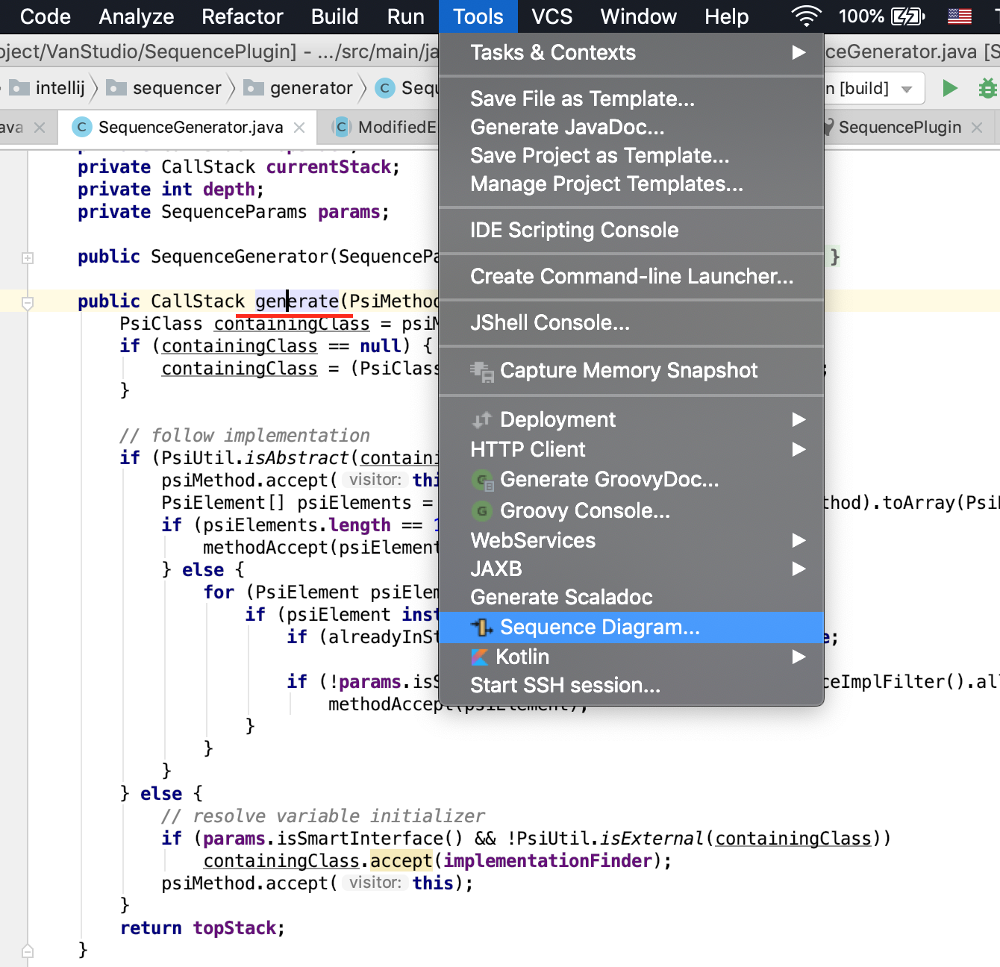
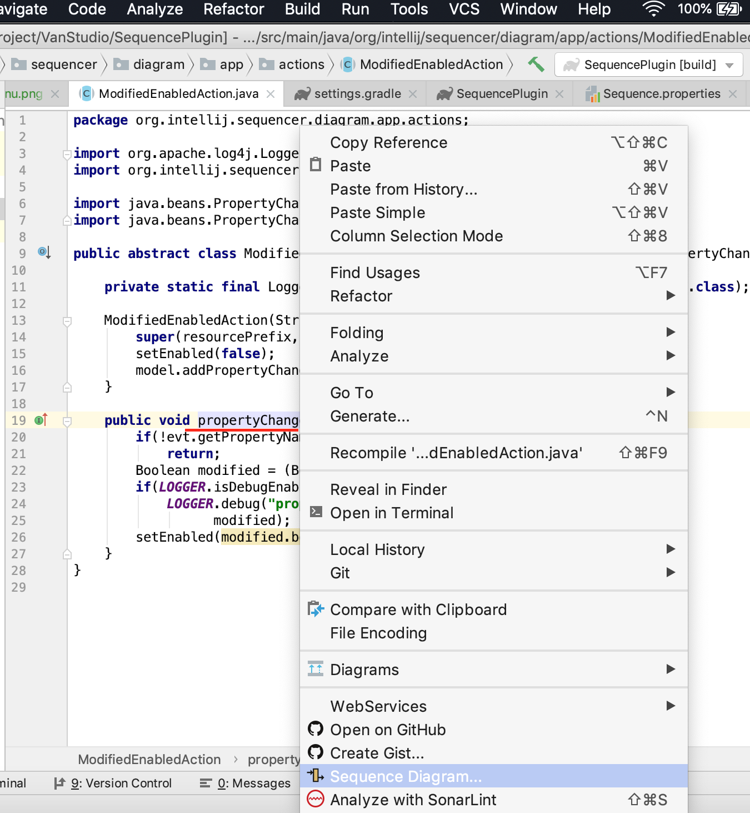

# SequenceDiagram
SequenceDiagram for IntelliJ IDEA
http://vanco.github.io/SequencePlugin.

with this plugin, you can
+ generate Simple Sequence Diagram.
+ Navigate the code by click the diagram shape.
+ Delete Class from diagram.
+ Export the diagram as image.
+ Exclude classes from diagram by Settings > Other Settings > Sequence
+ Smart Interface(experimental)
+ Lambda Expression(experimental)

## Experimental features
**The experimental features are created by myself, which is not part of UML standard. Use this feature in your own risk.**

### Smart Interface
Find the implementation of the interface smartly.  e.g.
```java
public interface Fruit {
    int eat();
}

public class Apple implements Fruit {
    @Override
    public int eat() {
        return 5;
    }
}
```
`Apple` implemented the `Fruit` interface. When we generate sequence diagram for the `eatFruit` method:
```java
public class People {
    
    private Fruit fruit = new Apple();

    public void eatFruit() {
        fruit.eat();
    }
}
```
I draw dummy `implementation call` in dash line.


For the interface or abstract class, if there is only one implementation found, it will draw in diagram automatically. 
More than one implementations, you need to choose one to draw. this is an option in settings.

### Lambda Expression
No standard for the lambda expression in the sequence diagram yet. So I create mine. e.g.
```java
public interface Service<Int, String> {

    String invoke(Int a);
}
```
And I need draw the sequence diagram for `hello` method:
```java
public class Lambda {

    public Service<Integer, String> hello() {
        return a -> {
            Fruit fruit = new Apple();
            fruit.eat();
            return "I'm good!";
        };
    }
}
```
I draw a dummy `λ→` self call in diagram.


## How to use
SequenceDiagram **ONLY** generate sequence diagram for the **CURRENT** method of **JAVA** file in the editor.
### When installed, where to find it?
1. Open a **JAVA** file in editor.
2. Navigate to one **Method**, which you want to generate sequence diagram. (See the screenshot bellow)
3. From the `Tools` > `Sequence Diagram...` menu.





Place the cursor inside the method, trigger it from `Tools` menu or `context` menu > `Sequence Diagram...`

## Version History
**Current Verison 1.3**

older:
<dl>
        <dt>1.3</dt>
        <dd>Lambda Expression. #38</dd>
        <dt>1.2</dt>
        <dd>new feature: Smart Interface, List implementation of interface in project, user can choose one to show in sequence diagram. If only one implementation found, it will show automatically. </dd>
        <dt>1.1</dt>
        <dd>fix issue #3 support parameter is anther method call, fix issue #4 support pipeline call.</dd>
        <dt>1.0.9</dt>
        <dd>fix issue #1 recognise more generic method definition, fix issue #2 show popup menu on mac and linux.</dd>
        <dt>1.0.8</dt>
        <dd>Refine not to call "Deprecated" methods. Add Exclude Settings. Change the name to SequenceDiagram. </dd>
        <dt>1.0.7</dt>
        <dd>Remove "com.intellij.diagram" dependency. </dd>
        <dt>1.0.6</dt>
        <dd>HotFix: add missing res file in version 1.0.5.</dd>
        <dt>1.0.5</dt>
        <dd>Narrow the plugin support product list to java.[ABANDONED]</dd>
        <dt>1.0.4</dt>
        <dd>fixbug: go to source</dd>
        <dt>1.0.3</dt>
        <dd>fixbug: NPE when call psiMethod.getContainingClass() on enum class.</dd>
        <dt>1.0.2</dt>
        <dd>Add Sequence Diagram... menu under the Tools menu and Editor popup menu group with Diagram.</dd>
        <dd>fixbug: method name with generic type.</dd>
</dl>

## Acknowledgement

#### Name history
+ **SequencePlugin** Maintained by Kentaur(Kesh Sibilev, ksibilve@yahoo.com) until 2011
+ **SequencePluginReload** Maintained by Vanhg(Evan Fan, fanhuagang@gmail.com) 2011 - 2015
+ **SequenceDiagram** Maintained by Vanco(Evan Fan, fanhuagang@gmail.com) since 2016

#### Why change name?
Since 2011, I found a solution of NPE of original **SequencePlugin**, so I write email to Kentaur with my solution,
He said he was not coding any more. Instead, he send me the code. I fix the NPE issue and publish to plugin
repository with new name **SequencePluginReload**.

But in 2015, the IntelliJ change the login system, and I lost my account, cannot continue publish new version to
the repository.

In 2016, I change the Name again to **SequenceDiagram** and host the source code on [github](https://github.com/Vanco/SequencePlugin).
Now it open source.

Thanks Kentaur for the great work on the original source.