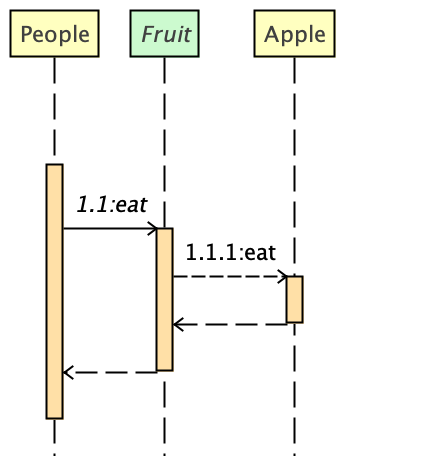
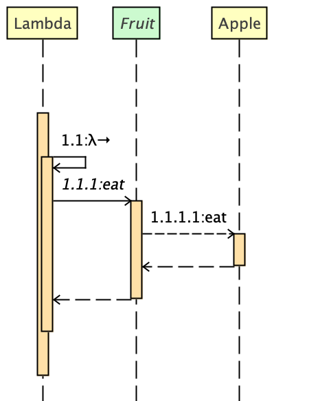

[](https://github.com/Vanco/SequencePlugin/releases)
[](https://plugins.jetbrains.com/plugin/8286-sequencediagram)

# SequenceDiagram
<!-- Plugin description -->
SequenceDiagram for IntelliJ IDEA
https://vanco.github.io/SequencePlugin.

with this plugin, you can
+ generate Simple Sequence Diagram.
+ Navigate the code by click the diagram shape.
+ Delete Class from diagram.
+ Export the diagram as image(SVG, JPEG, PNG, TIFF).
+ Export the diagram as PlantUML, Mermaid format file.
+ Exclude classes from diagram by Settings > Tools > Sequence Diagram
+ Smart Interface(experimental)
+ Lambda Expression(experimental)
+ Kotlin Support(Experimental, No code navigation)
<!-- Plugin description end -->

## Experimental features
**The experimental features created by myself, which is not part of UML standard. Use this feature in your own risk.**

### Smart Interface
Find the implementation of the interface smartly.  e.g.
```java
public interface Fruit {
    int eat();
}

public class Apple implements Fruit {
    @Override
    public int eat() {
        return 5;
    }
}
```
`Apple` implemented the `Fruit` interface. When we generate sequence diagram for the `eatFruit` method:
```java
public class People {
    
    private Fruit fruit = new Apple();

    public void eatFruit() {
        fruit.eat();
    }
}
```
I draw dummy `implementation call` in dash line.



For the interface or abstract class, if there is only one implementation found, it will draw in diagram automatically. 
More than one implementation, you need to choose one to draw. this is an option in settings.

### Lambda Expression
No standard for the lambda expression in the sequence diagram yet. So I create mine. e.g.
```java
public interface Service<Int, String> {

    String invoke(Int a);
}
```
 I need draw the sequence diagram for `hello` method:
```java
public class Lambda {

    public Service<Integer, String> hello() {
        return a -> {
            Fruit fruit = new Apple();
            fruit.eat();
            return "I'm good!";
        };
    }
}
```
I draw a dummy `() ->` self call in diagram.



### Kotlin support
The Kotlin language support are in very early stage. 
  - [x] Support generate topLevel function
  - [x] Support generate PrimaryConstructor and SecondaryConstructor
  - [x] Support generate Default Constructor Class
  - [x] Support generate JavaCall deeply
  - [ ] Support generate lambda argument
  - [ ] Support generate function with expression body
  - [x] Support generate class initializer
  - [ ] Code navigation

## How to use
SequenceDiagram can generate sequence diagram from JAVA and Kotlin File. 
### When installed, where to find it?
Since v2.1.0, the UI has improved a lot. now you can easily find it everywhere :)
1. In navigation toolbar, A new ICON {:height="24px" width="24px"} added.
2. In Tools menu. `Tools` > `Sequence Diagram`
3. In Project view popup up menu. `Sequence Diagram ...`
4. In Editor popup up menu. `Sequence Diagram`
5. ~~In IntentionAction tips.`Generate sequence diagram`~~(removed, not stable)
6. Shortcut `Alt S` for windows, `Option S` for macOS
7. Structure popup up menu `Sequence Diagram`

Please try to experience it and find what happen. 

Have fun!

## Version History
Current Version

[](https://github.com/Vanco/SequencePlugin/releases)

versions history:
[Changelog](CHANGELOG.md)

## Acknowledgement

#### Name history
+ **SequencePlugin** Maintained by Kentaur(Kesh Sibilev, ksibilve@yahoo.com) until 2011
+ **SequencePluginReload** Maintained by Vanhg(Evan Fan, fanhuagang@gmail.com) 2011 - 2015
+ **SequenceDiagram** Maintained by Vanco(Evan Fan, fanhuagang@gmail.com) since 2016 
  {:height="32px" width="32px"}

#### Why change name?
Since 2011, I found a solution of NPE of original **SequencePlugin**, so I write email to Kentaur with my solution,
He said he was not coding anymore. Instead, he sent me the code. I fix the NPE issue and publish to plugin
repository with new name **SequencePluginReload**.

In 2015, the IntelliJ change the login system, and I lost my account, cannot continue to publish new version to
the repository.

In 2016, I change the Name again to **SequenceDiagram** and host the source code on [github](https://github.com/Vanco/SequencePlugin).
Now it is open source.

Thanks Kentaur for the great work on the original source.