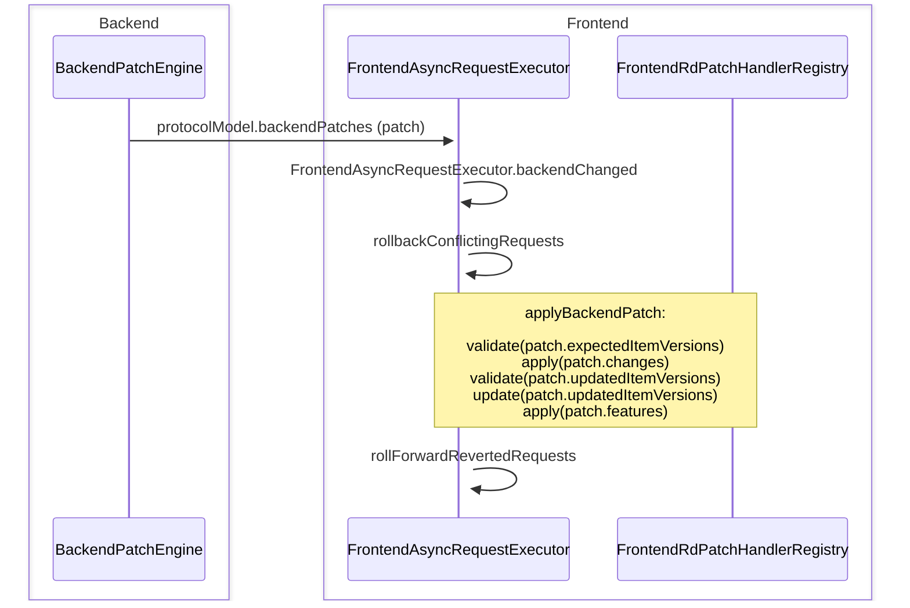
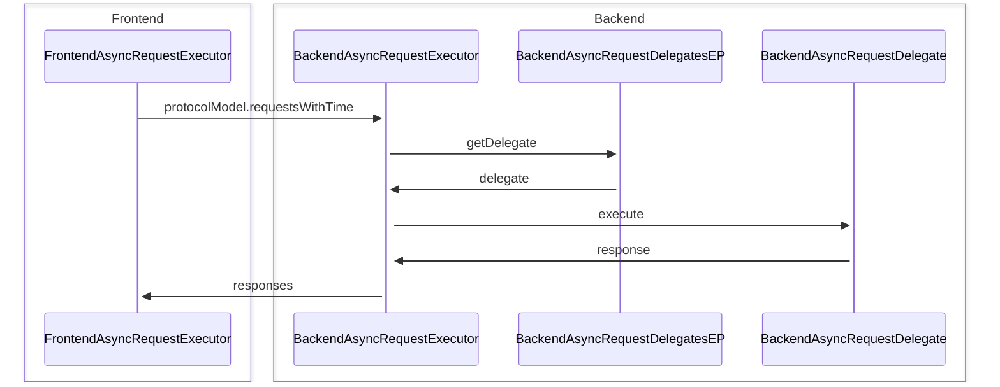
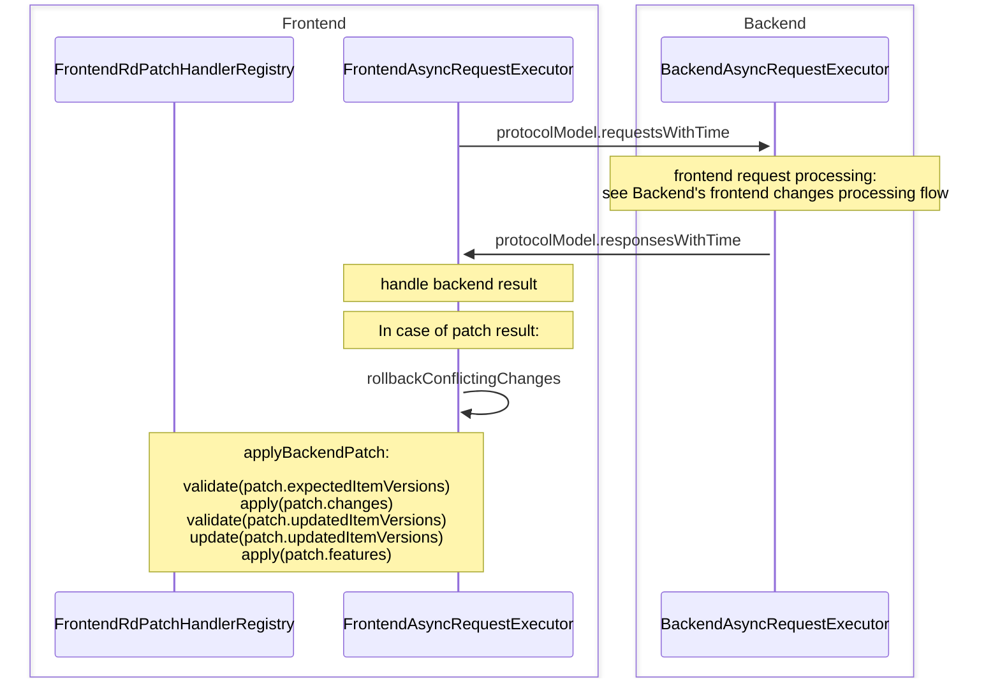

# Frontend's backend changes processing flow
When backend changes are received, they are processed as follows:

# Backend's frontend changes processing flow
When frontend changes are received, they are processed as follows:

# Frontend requests flow
When frontend requests are sent, they are processed as follows:

# RdPatchHandlers
For purpose of extensible patch content handling we have RdPatchItemHandler interfaces on frontend and backend.
It's used through corresponding RdPatchHandlerRegistry over collection of items to handle.
It has the following methods:
- validate runs over collection of RdPatchItemVersion and typically used to check if version is right.
- update runs over collection of RdPatchItemVersion and updates corresponding entity version.
- apply runs over collection of RdPatchStep which and intended to use for actual patche's changes application. It returns FrontendRdPatchApplyResult which is used to return some results from aplly operation.

Each of these methods also has context parameter which is used to provide additional information for operations such as project, operation type and so on.

# Custom settings during patch application
Sometimes, we want to set some settings for patch operations. For example - we set DISABLE_CARET_SHIFT_ON_WHITESPACE_INSERTION during patch application.

For this purpose, we have PatchAccessToken EP. It provides usual access token that we get via corresponding EP (frontend/backend).
Check BackendEditorSettingsAccessTokenProvider for example.